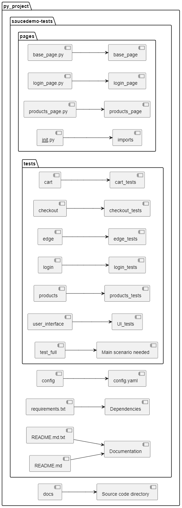
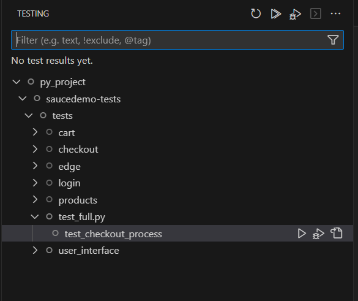
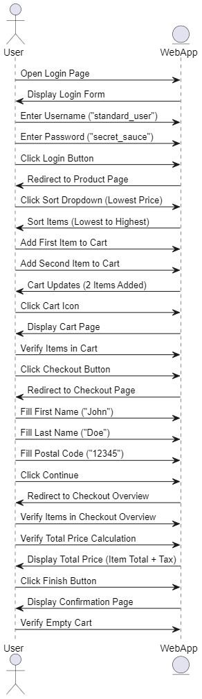

# Python Testing with Pytest

This project demonstrates how to write and run tests using the [`pytest`](https://docs.pytest.org/) framework in Python.

## 📁 Project Structure


## 🚀 Getting Started

### 1. Clone the Repository

```bash
git clone https://github.com/your-username/your-repo-name.git
cd your-repo-name
```
### 2. Create a Virtual Environment

```bash
python -m venv venv
source venv/bin/activate  # On Windows use `venv\Scripts\activate`
```

### 3. Install Dependencies

```bash
pip install -r requirements.txt
```

### 4. 🧪 Running Tests

To run all test cases:

```bash
pytest
```

To run tests with verbose output:

```bash
pytest -v
```

To run a specific test file:

```bash
pytest tests/login/test_login_valid_user.py
```


📊 Code Coverage (Optional):

```bash
pip install pytest-cov
pytest --cov=src
```

⚡ Parallel Test Execution (Optional):

```bash
pip install pytest-xdist
pytest -n auto
```



### Main test scenario 




# Other test scenarios

## :test_tube: Tests

<details>
    <summary>Unit Tests</summary>

### Unit Tests

To unit-test an event-sourced aggregate, it's to verify that the Aggregate produces the expected event as output given a specific set of input Events and a Command. This involves creating an Aggregate
instance, applying the input events to it, handling the command, and verifying the expected event output.

```csharp
[Fact]
public void CreateCartShouldRaiseCartCreated()
    => Given<ShoppingCart>()
        .When<Command.CreateCart>(new(_cartId, _customerId))
        .Then<DomainEvent.CartCreated>(
            @event => @event.CartId.Should().Be(_cartId),
            @event => @event.CustomerId.Should().Be(_customerId),
            @event => @event.Status.Should().Be(CartStatus.Active));
```

</details>

<details>
    <summary>Integration Tests</summary>

### Integration Tests

// TODO

</details>

<details>
    <summary>Load Tests</summary>

### Load Testing (K6)

```bash
docker run --network=internal --name k6 --rm -i grafana/k6 run - <test.js
```

</details>
